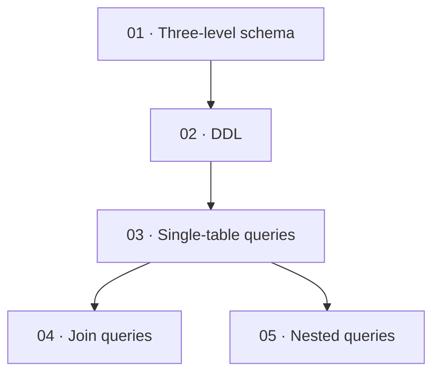

# Note structure conventions

> This document defines "what a review note looks like". The point of these conventions is: **three months from now you can find things at a glance,
> later material slots in seamlessly, and every output from the AI looks the same.**

---

## 1. Directory structure

```
<topic>/
├── 00-overview-and-knowledge-chain.md   # Required. MOC (Map of Content)
├── 01-<first-knowledge-cluster>.md
├── 02-<second-knowledge-cluster>.md
├── …
├── <next>-cheatsheet.md                 # Optional but strongly recommended: one printable page
├── <next>-errata-and-open-questions.md  # Optional but strongly recommended
└── _sources/                            # Extraction outputs: visual transcription text of scanned documents, etc.
```

> **What `_sources/` is**: it holds **non-regenerable extraction outputs** (visual transcriptions of scanned documents, conversation extracts).
> They aren't part of the notes, but deleting them means rerunning the whole extraction chain (tens of minutes + many model calls), so by convention they're kept here.
> **Regenerable** intermediates such as rendered PNGs are cleaned up when the task ends — for the criterion and the duty to inform at delivery,
> see [`extraction-playbook.md`](extraction-playbook.md#writing-to-disk-and-cleanup).
> `check_notes.py` skips the `_sources/`, `_extract/`, and `templates/` directories — they're not counted in the statistics and don't raise errors.

### Granularity

**One note = one knowledge cluster — not one slide, and not one textbook chapter.**

| Material characteristic | Note split |
|---|---|
| A chapter contains 3 independent concepts | Split into 3 notes (each reviewable on its own) |
| Two sections actually cover two sides of one thing | Merge into 1 note (splitting leaves each incomplete) |
| A concept is referenced repeatedly and underpins later material | Give it its own note, numbered early |

Test: **"Can this note be taken and reviewed on its own?"** If not, adjust the boundary.

### Naming conventions

- Use a **two-digit** `NN-` number, `01` rather than `1` (so lexicographic order = logical order)
- Titles in the user's language, hyphen-joined; **avoid `:`** (illegal in Windows file names and truncated by some tools)
- `00` is reserved for the MOC overview; the cheatsheet and the errata page **continue the same sequence** after the last body note (body `01…N`, then `N+1-cheatsheet.md`, `N+2-errata-and-open-questions.md`). Do not reserve high numbers like `98`/`99`.
- Don't use book-title marks / quotation marks and similar symbols; they cause cross-platform path problems

---

## 2. YAML frontmatter

Every note must begin with:

```yaml
---
tags: [SQL, query, join query]
created: 2026-10-03
updated: 2026-10-05
source: Database Systems Principles, ch. 3, slides p12-34
---
```

| Field | Required | Description |
|---|---|---|
| `tags` | ✅ | For global search and the graph. 3–6 of them, covering both the "subject" and "knowledge point" levels |
| `created` | ✅ | Date first created |
| `updated` | ✅ | Updated on every change (makes stale notes easy to spot) |
| `source` | ✅ | Source: file name + chapter/page, or a URL. **Used to trace back and verify** |
| `status` | Optional | `draft` / `complete` / `needs-review` |
| `related` | Optional | A list of wikilinks to related notes. **May reference notes not yet created** (C4 skips frontmatter) |

> `source` is the item most easily omitted and the most important. Without it, when a question comes up later you can't go back to the book to verify.

---

## 3. `00-overview-and-knowledge-chain.md`

The MOC is the **entry point** to the whole folder. It has six fixed sections:

### ① One-line overview

```markdown
> [!abstract] What problem this topic solves
> In one or two sentences: why this body of knowledge matters, and what you can do once you've learned it.
```

### ② Knowledge chain

Express the **dependency relationships between concepts** with an ASCII diagram or mermaid — not a table of contents:

```markdown
Three-level schema → DDL (tables/constraints) → DML (insert/update/delete) → DQL (query) → Views → Privileges
                                                                                  ↑
                                                       Join / Nested / Set (the three ways to combine queries)
```

Or mermaid (natively supported by Obsidian):

````markdown

````

### ③ Concept responsibility table

What each component/concept is "responsible for and not responsible for" — one table that clears up the boundaries:

| Concept | Responsibility | Not responsible for |
|---|---|---|
| `WHERE` | Filters rows **before** grouping | Filtering aggregated results (that's `HAVING`) |
| `HAVING` | Filters groups **after** grouping | Use on its own (needs a `GROUP BY` context) |

### ④ Learning path

The review order arranged by dependency, with estimated time and prerequisites.

### ⑤ Note index + progress tracking

```markdown
| # | Note | Status | One line |
|---|---|---|---|
| 01 | [[01-SQL-overview-and-three-level-schema]] | ✅ | External/schema/internal schema and the two-level mapping |
| 02 | [[02-data-definition-DDL]] | ✅ | Tables, constraints, indexes |
| 03 | [[03-single-table-queries]] | 🔄 exercises pending | The basic `SELECT` framework |
```

**Come back and update this table every time a note is added.** It's the folder's table of contents.

### ⑥ Question quick-reference (the points you get stuck on most while reviewing)

One question, a one-line answer, linked to the full explanation. This is the **most-used section during review**:

```markdown
| Question | One-line answer | See |
|---|---|---|
| Which runs first, `WHERE` or `HAVING`? | `WHERE` first, acting on rows; `HAVING` after, acting on groups | [[03-single-table-queries]] |
```

---

## 4. Single-note skeleton

```markdown
---
tags: [...]
created: ...
updated: ...
source: ...
---

# 03 · Single-table queries

> [!abstract] One line
> The full execution order of `SELECT` and the scope of each clause.

## Why you need it
(Problem background. Without this section the reader doesn't know why the syntax/concept exists.)

## Core mechanism
(Body. Definition → mechanism → step-by-step expansion. Subheadings by logic, not by the book's chapters.)

## Examples (actually run)
(Examples that were really run, with output.)

## Variants and boundaries
(Counterexamples, easily confused cases, failure conditions, version differences.)

## Relations to adjacent concepts
(Point to neighbors in the knowledge cluster; state the difference and the connection.)

## Quick self-test
(3–5 questions, answers collapsed.)

---
**Upstream**: [[02-data-definition-DDL]]  **Downstream**: [[04-join-queries]] · [[05-nested-queries]]
```

### Pick a template by subject first

The above is the **generic skeleton**. The three subject types hold different kinds of knowledge, so the starting template differs too:

| Subject type | Template | Difference from the generic skeleton |
|---|---|---|
| A Theory (math / physics / chemistry / statistics) | [`templates/note-math.md`](../templates/note-math.md) | Replaces "core mechanism" with "objects and notation → statement of propositions → derivation (cite the basis for each step) → conditions of applicability → worked examples" |
| B Engineering (programming / networks / operating systems / databases / electronics) | [`templates/note-cs.md`](../templates/note-cs.md) | Splits "core mechanism" into "minimal runnable example (paste the output as-is) → mechanism → error analysis → environment difference table" |
| C Humanities (history / philosophy / law / literature / social science) | [`templates/note-humanities.md`](../templates/note-humanities.md) | Starts with 3–7 one-line backbone points, then hangs the details off them; ends with sources and Cornell-style self-test |

For the criterion ("what happens if this is wrong"), the full skeletons, and how to verify them, see
[`subject-strategies.md`](subject-strategies.md).

### Writing notes for each section

| Section | Key points |
|---|---|
| Why you need it | Give the **motivation**. A knowledge point without motivation won't stick, and can't be recalled in an unfamiliar problem |
| Core mechanism | **Rewrite, don't transcribe**. Turn the original's lecturing tone into declarative statements |
| Examples | Must be labeled `(actually run)` or `(not actually run)`. Actually-run ones include the environment/version |
| Variants & boundaries | This is the section that **adds the most value**. Material usually gives only the positive cases; you must fill in the boundaries yourself |
| Relations to adjacent concepts | State the difference in one line ("X handles rows, Y handles groups") and give a wikilink |

---

## 5. Visual element conventions

### Callout (Obsidian) / blockquote (plain)

| Type | Use |
|---|---|
| `> [!abstract]` | One-line lead at the top of a note |
| `> [!tip]` | Memory tricks, shortcuts |
| `> [!warning]` | Error-prone points, high-risk operations |
| `> [!question]` | Self-test questions, open questions |
| `> [!bug]` | Errors in the material itself (knowledge-point errors only; see the errata page) |
| `> [!example]` | Standalone example |

In plain mode, use a bold prefix like `> **Tip**: …`.

### ASCII diagrams

Put structure, flow, and memory layouts in ASCII diagrams inside code blocks — **cross-platform, readable as plain text, never distorted**:

````markdown
```
        ┌──────────────────┐
        │ external schema  │ ← user view
        └────────┬─────────┘
                 │ external-schema/schema mapping
        ┌────────┴─────────┐
        │      schema      │ ← logical structure
        └──────────────────┘
```
````

### Tables

- **Always use tables** for comparison-type content; far clearer than paragraphs
- Inside table cells write a wikilink alias as `[[path\|alias]]` (escaped); in the body write `[[path|alias]]`
- Don't stuff line breaks into tables; if you need multiple lines, split into two tables

---

## 6. Designing the quick self-test

The self-test at the end is **not decoration** — it's this note's acceptance criterion.

- 3–5 questions covering this note's core mechanism + at least one boundary case
- Collapse the answers (in Obsidian use a collapsible `> [!question]-` callout, or `<details>`)
- Questions must **genuinely make you stuck**: ask more "why" and "what if…", fewer "what is"

```markdown
## Quick self-test

> [!question]- 1. Why can't `WHERE Grade < 60` find students who missed the exam?
> Because when `Grade` is `NULL`, `NULL < 60` evaluates to **UNKNOWN**, and `WHERE` keeps only TRUE rows.
> Correct form: `WHERE Grade < 60 OR Grade IS NULL`.

> [!question]- 2. Can `HAVING` reference a column that does not appear in `GROUP BY`?
> Standard SQL forbids it (the column has no unique value within the group). MySQL's default permissive mode lets it through, but the result is indeterminate.
```

### Optional: export to Anki

The self-test questions have a regular structure, so they can be extracted by script into an Anki-import TSV (`question<TAB>answer<TAB>tags`).
Very useful for subjects needing long-term memorization (foreign languages, terminology, formulas).

---

## 7. Link syntax

| Scenario | Syntax |
|---|---|
| Obsidian body | `[[03-single-table-queries]]` or `[[03-single-table-queries\|single-table queries]]` |
| Inside an Obsidian table | `[[03-single-table-queries\|single-table queries]]` (**must escape `\|`**) |
| Obsidian to a section | `[[03-single-table-queries#variants-and-boundaries]]` |
| plain / GitHub | `[single-table queries](03-single-table-queries.md)` |
| External | `[MDN: SELECT](https://…)` |

> Links **in the body** must not point to notes not yet created — broken links leave holes in the knowledge graph.
> Put planned notes in the `00-overview` index table, marked `⬜ to-create`, **not as a wikilink**.
>
> **Exception: the `related` / `source` frontmatter fields** may reference notes not yet created
> (planning first and filling in later is a normal workflow). `check_notes.py`'s C4 **skips frontmatter blocks**,
> so such references aren't falsely reported as broken links.
>
> **An emoji in a heading makes its `#anchor` fragile.** GitHub drops the emoji's base character but **keeps
> its variation selector**: `## ⚠️ Language rule` renders as `id="…-️-language-rule"` — with an invisible
> `U+FE0F` before the hyphen, so a hand-written `#-language-rule` link silently never scrolls. Either don't
> link to a heading that carries an emoji, or drop the emoji from any heading you need to link.
> The slug rule to mirror is github-slugger's: keep **letters / numbers / marks / connector punctuation /
> spaces**, drop everything else, then one `-` per space.

---

## 8. Continuation rules (when new material arrives for the same topic)

1. **Don't create a new folder** — find the existing topic folder
2. Read `00-overview`; confirm the existing numbering and knowledge chain
3. Append the new note **after the highest number** (it may belong at a logical position → then renumber and update all links in sync)
4. If an existing note overlaps the new material → **extend the original note** (and update `updated`); don't start a new one
5. Update `00-overview`'s knowledge chain, index table, and progress
6. Finally run `check_notes.py` to confirm there are no broken links

> Renumbering is the only operation that breaks links. If you must do it, replace globally with a script and immediately run the checker.
